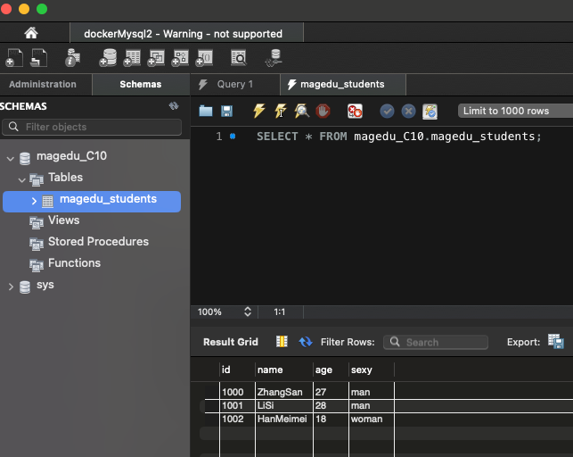

## 网络安全C10-2024.8.24

### 1、在docker中分别以后台方式和交互方式启动centos，对比启动后的容器状态，实现退出容器也能保持其运行状态。

**以后台方式启动 CentOS 容器**

```dockerfile
docker run -d --name centos-background centos:latest sleep infinity
```

**以交互方式启动 CentOS 容器**

```dockerfile
docker run -it --name centos-interactive centos:latest
```


#### 2、在docker并部署DVWA，要求：DVWA web 端口映射到8082，提供访问截图。

```dockerfile
docker pull sagikazarmark/dvwa
docker run -d -p 8082:80 -p 33060:3306 --name dvwa  sagikazarmark/dvwa
```




### 3、Mysql练习

#### （1）创建一个名为"magedu_C10"的数据库；

```mysql
docker run -p 33061:3306 --name mysql -e MYSQL_ROOT_PASSWORD=123456 -d mysql:latest
docker exec -it mysql mysql -uroot -p123456
create database magedu_C10;
```


#### （2）在magedu_C10数据库中创建一张名为"table_Sec"的表，要求有序号、姓名、年龄、性别参数；

```msyql
use magedu_C10;
create table magedu_students( id int, name varchar(255), age int, sexy varchar(255));
```


#### （3）在table_Sec表中插入数据，序号是个人学号数字部分，姓名是拼音缩写，年龄、性别无要求；

```my
insert into magedu_students value(1000,'ZhangSan',27,'man');
insert into magedu_students value(1001,'LiSi',28,'man');
insert into magedu_students value(1002,'HanMeimei',18,'woman');
```


#### （4）使用Navicat连接你所创建的数据库，查看个人信息并提供截图。


### 4、以下哪个口令不是弱口令？答案： D

A. p@ssw0rd

B. m@a#g$e%d&u

C. 1QAZ2wsx

D. MaGEdu@0513
